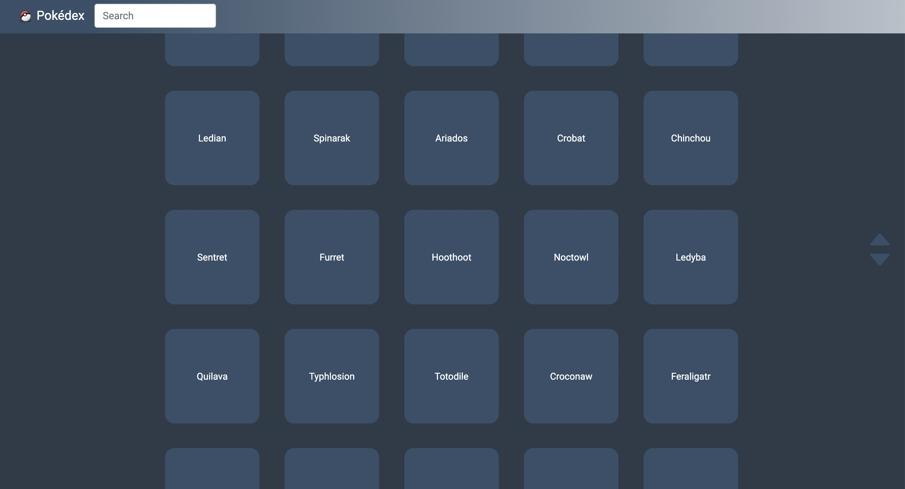

# Pokédex

The Pokemon Index loads data from an <strong>external API</strong> and enables the user to view data points as pokemon from a JSON list.
Main purpose of this app is to present how I create a JavaScript application.<br>
The app is using github pages.
<br>

<strong>[LIVE DEMO](https://koola123.github.io/pokedex/)</strong>

<br>




# 🎯 Technology used:
- HTML5
- CSS3
- j.Query
- JavaScript
- Bootstrap


# Project API Link:
```html
https://pokeapi.co/api/v2/pokemon/?limit=500
```

# 🛠 Next Features
* Add more stats
* Pokemon animation

<br>

Version: 1.0.0

