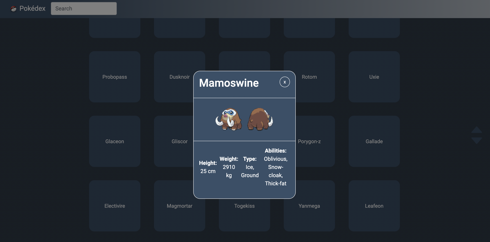

# Pokédex

Pokédex is a web app built with `JavaScript`, `HTML`, `CSS`, `j.Query` and `Bootstrap`.
It loads data from an *external API* and enables the user to view data points as Pokémons from a JSON list.

The main purpose of this app is to present how I create a JavaScript app.

This site was built using GitHub Pages.


### See the hosted project right here:
<<<<<<< HEAD
<br>

<strong>[LIVE PREVIEW](https://koola123.github.io/Pokedex/)</strong>




=======
<b>[LIVE DEMO](https://koola123.github.io/pokedex/)</b>

>>>>>>> f0d9141e30b5dd2a52a92f3eade234f09d8f6829

## Used API for this project:
```html
https://pokeapi.co/api/v2/pokemon/?limit=500
```

<<<<<<< HEAD
## Upcoming Features
* Pokemon Stats
* Pokemon Animation

<br/>

Version: 1.0.0
=======
## Key Features:
* Load data from an external source (API)
* View a list of pokemon items on a responsive webpage
* On user action (e.g., by clicking on a list item), view details for that item
* Live search to find certain pokemons in the list

## Code quality and performance

* Javascript Minifier is used to remove unnecessary pieces of the file to decrease its file size.
* Performance was checked with Chrome developer tools on different network speeds and different CPU speeds. In the case of recursive functions, the innerHTML and document.write() commands were replaced by specific DOM manipulation commands like classList.add, innerText, appendchild, etc.
* ESLint was used for code quality.
* The app was tested on different screen sizes with Chrome developer tools.


## Future improvements
* Touch interactions (pointer events), e.g., swiping between pokemon items
* Adding a loading indicator
* Making the app more aesthetically pleasing or including more features, such as an optimized pokemon
search
>>>>>>> f0d9141e30b5dd2a52a92f3eade234f09d8f6829
